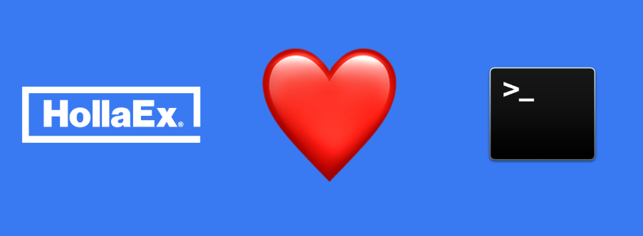

## HollaEx CLI

HollaEx CLI is a command-line tool for operating [HollaEx Kit](https://github.com/bitholla/hollaex-kit) with simple commands. Anyone even without deep knowledge on Kubernetes and Docker can play with HollaEx Kit easily with this awesome CLI.

### Installation

You can easily install HollaEx CLI with a simple command below.

Make sure you already installed `docker` and `docker-compose` for local deployment, `kubectl` and `helm` for production Kubernetes deployment. HollaEx CLI will not work properly if those things are missing on your machine.

```
curl -L https://raw.githubusercontent.com/bitholla/hollaex-cli/master/install.sh | bash
```

Enjoy :)

### Uninstallation

Similar as installation, Uninstalling HollaEx CLI is easy either. You can use one simple command below to completely remove HollaEx CLI from your computer.
=
```
curl -L https://raw.githubusercontent.com/bitholla/hollaex-cli/master/uninstall.sh | bash
```

## Documents

Plesae visit HollaEx Kit [repository](https://github.com/bitholla/hollaex-kit) to see the full usage and details.